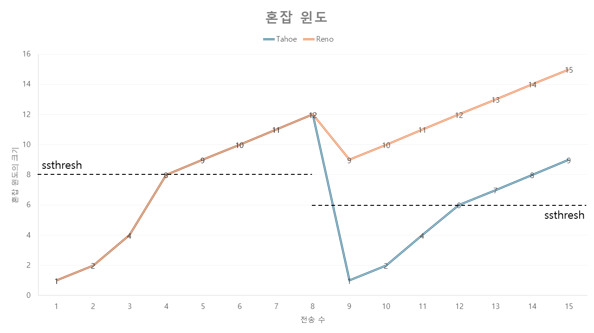

### GBN (Go-Back-N, N부터 반복) 프로토콜
### = 슬라이딩 윈도 프로토콜(Sliding-window protocol)
> 확인 응답을 기다리지 않고 여러 패킷을 전송
### 윈도 크기
> 아직 확인응답(ACK)이 오지 않은 패킷을 허용할 수 있는 순서 번호 범위
### 확장된 FSM(extended FSM)
> ?
### 누적 확인 응답(Cumulative acknowledgment)
> [GBN 프로토콜](#gbn-go-back-n-n부터-반복-프로토콜)에서 순서번호 n을 가진 패킷에 대한 확인 응답 
> 모든 것에 확인 응답을 받는 것이 아니라 정상 수신한 마지막 패킷 번호만 회신
### 이벤트 기반 프로그래밍(Event-based Programming)
> 다양한 이벤트에 대한 대응으로 취할 수 있는 동작을 구현
### SR(Selective Repeat, 선택적 반복)
> 수신자에서 오류(손실되거나 변조)가 발생한 패킷을 수신했다고 의심되는 패킷만을 송신자가 다시 전송하므로 불필요한 재전송을 피함 
> 개별적인 재전송은 수신자가 올바르게 수신된 패킷에 대한 개별적인 확인응답(ACK)을 요구
### TCP : 트랜스포트 계층(layer 4) 프로토콜
- 연결지향형
    > 데이터를 보내기 전에 두 프로세스가 서로 '핸드셰이크'를 먼저 해야 함
- 전이중 서비스(full-duplex service)
    > TCP 연결은 전이중 서비스를 제공
- 점대점(point-to-point)
    > TCP 연결은 항상 단일 송신자와 단일 수신자 사이 점대점
- 클라이언트 프로세스(Client Process)
    > 연결을 초기화하는 프로세스
- 서버 프로세스(Server Process)
    > 클라이언트 프로세스가 아닌 것
- 세 방향 핸드 셰이크
    > TCP 연결 시 두 호스트 사이 3개의 세그먼트가 보내지므로 세 방향 핸드셰이크라고 불림
- 송신 버퍼(send buffer)
    > TCP는 초기 세 방향 핸드셰이크 동안 준비된 버퍼 중 하나인 연결의 송신 버퍼로 데이터를 보냄
---
### 최대 세그먼트 크기(MSS, Maximum Segment Size)
> 세그먼트로 모아 담을 수 있는 최대 데이터의 양
### 최대 전송 단위(MTU, Maximum Transmission Unit)
> 로컬 송신 호스트에 의해 전송될 수 있는 가장 큰 링크계층 프레임의 길이
### TCP 세그먼트 (TCP Segment)
> = TCP 헤더 + 클라이언트 데이터
### TCP 헤더
- 출발지와 목먹지 포트번호(Source and Destination port number)
- 체크섬 필드(Checksum field)
- 32bit 순서번호 필드(Sequence number field)
- 32bit 확인응답번호 필드(Acknowledgement number field)
- 16bit 수신 윈도(Receive window)
- 4bit 헤더길이 필드(Header length field)
- 가변 길이 옵션 필드(Option field)
- 6bit 플래그 필드(Flag field)
  - RST, SYN, FIN: 연결 설정과 해제
  - PSH: 수신자가 데이터를 상위 계층에 즉시 전달해야 함
  - URG: 송신 측 상위 계층 개체가 '긴급'으로 표시하는 데이터
- 16bit 긴급 데이터 포인터 필드(Urgent Data Pointer field)
### 세그먼트에 대한 순서번호
> 세그먼트에 있는 첫 번째 바이트의 바이트 스트림 번호
### 호스트가 자신의 세그먼트에 삽입하는 확인응답 번호는 다른 호스트에게 기대하는 다음 바이트의 순서번호를 의미
### TCP는 누적 확인 응답(Cumulative acknowledgment)를 제공
### 피기백(Piggybacked)
> 클라이언트/서버 데이터에 대한 확인 응답이 데이터 세그먼트 상에서 피기백 됨
### 지수적 가중 이동 평균(EWMA, Exponential Weighted Moving Average)
> 최신 샘플이 네트워크상 현재 ㅎ노잡을 더 잘 반영하기 때문에 최근 샘플에 높은 가중치를 부여 
> 가중치 갱신 절차가 진해오딤에 따라 빠르게 지수적으로 감소
$$추정된RTT = (1 - \alpha) 추정된RTT + \alpha \times sampleRTT  \tag{권장 a = 0.125}$$
### 신뢰적인 데이터 전송 서비스(Reliable data transfer service)
> TCP는 IP의 비신뢰적인 최선형 서비스에게 신뢰적인 데이터 전송 서비스를 제공
### 중복 ACK(Duplicate ACK)
> 송신자가 이미 이전에 받은 확인 응답에 대한 재확인 응답 세그먼트 ACK
### 빠른 재전송(Fast retransmit)
> 타이머가 만료되기 이전 손실 세그먼트 재전송
### 선택적 확인응답(Selective acknowledgment)
> 누적 확인응답과 달리 '순서가 틀린' 세그먼트에 대해 선택적 확인응답
### 흐름제어 서비스(flow-control service)
> 수신자가 수신받을 수 있는 만큼만 송신조절
### SYN 플러드 공격
> 공격자는 세번째 핸드셰이크를 완료하지 않은 무수한 TCP SYN 세그먼트를 보내 수 많은 연결 자원이 공격자에게 할당 
> = 합법적인 클라이언트의 서비스가 거부됨 
:arrow_forward: SYN쿠키로 해결 가능
### SYN 쿠키
> 세그먼트가 정당한 사용자로부터 왔는지 확인되기 전까지 연결을 만들지 않고 해시 함수를 보내 이를 ACK 세그먼트로 회신하면 연결을 열고 보내지 못하면 연결을 열어주지 않음
### 연결당-처리량(per-connection throughtput)
> 송신되는 데이터 양에 따른 수신되는 데이터의 양 
> 링크 용량을 넘기 전까지는 송신량 = 수신량링크 용량이 넘어가면 송신량이 늘어도 수신량은 동일(최대치)

### 패킷 도착률이 링크 용량에 근접함에 따라 큐잉 지연이 커진다
### 송신율 = 바이트/초
### 제공된 부하(Offered load)
> = 원래 데이터 + 재전송 데이터
- 재전송 데이터: 이전에 버려진 패킷
### 혼잡 제어
- 종단간 혼잡 제어
  > 세그먼트 손실이나 RTT가 증가하면 혼잡으로 받아들이고 윈도우 크기를 줄임
- 네트워크 지연 혼잡 제어
  > 라우터가 네트워크 안에서 혼잡 상태 관련하여 송수진자 모두에게 피드백을 전송
### ABR(Avilable Bite Rate)
> 혼잡제어에서 라우터가 자신이 출력 링크에 제공할 수 있는 전송률을 송신자에게 명확하게 전달 가능
### 혼잡 윈도(cwnd, Congestion WiNDow)
> TCP 송신자가 네트워크로 트래픽을 전송할 수 있는 속도에 제약을 가함
### 자체 클로킹(Self-clocking)
> TCP는 확인 응답을 혼잡 윈도 크기의 증가를 유발하는 트리거(trigger) 또는 클록(clock)을 사용
## TCP 혼잡제어 알고리즘(TCP congestion-control algorithm)
- 슬로 스타트(slow start)
- 혼잡 회피(congestion avoidance)
- 빠른 회복(fast recovery)
### 슬로 스타트(Slow start)
1. TCP 연결이 시작
    > 혼잡 윈도(cwnd) = 1MSS
2. 확인 응답을 받을 때마다 cwnd 지수적 증가
    > cwnd += 1MSS
3. 타임 아웃(혼잡) 발생
    > cwnd = 1MSS, 
    > 슬로스타트 임곗값(ssthresh) = cwnd / 2
4. 다시 cwnd 지수적 증가 하다가 sstrech 도달하면 [혼잡 회피](#혼잡-회피congestion-avoidance)모드로 전환
### TCP 분할
> 클라우드 서비스에서 TCP의 슬로스타트로 인해 발생하는 성능 저하를 TCP 분할을 활용하여 개선할 수 있다
### 혼잡 회피(Congestion Avoidance)
> cwnd = 마지막_혼잡_발견시점 / 2
- RTT 마다 cwnd += 1MSS
### 빠른 회복
> cwnd값을 손실된 세그먼트에 대해 수신된 모든 중복된 ACK에 대해 MSS만큼 증가
### TCP 혼잡 회피 알고리즘 = 타임아웃이 발생한 슬로스타트
### TCP 타호(Tahoe)와 리노(Reno)의 혼잡 발생 시 혼잡 윈도 비교
- TCP 타호(Tahoe): 초기 TCP 버전
  > 슬로 스타트
- TCP 리노(Reno)
  > 빠른 회복

### TCP 혼잡제어 = AIMD
### 가법적 증가 승법적 감소(AIMD, additive-increase multiplicative-decrease)
> TCP의 혼잡제어는 RTT마다 1MSS씩 cwnd의 선형(가법적) 증가, 3개의 중복 ACK 이벤트에서 cwnd를 반감(승법적 감소)
### TCP 큐빅(TCP CUBIC)
> TCP 리노의 개선 버전(혼잡 회피 동작 개선) 

### 명시적 혼잡 알림(ECN, Explicit Congestion Notification)
> 인터넷 내에서 수행되는 네트워크 지원 혼잡 제어의 한 형태 
> 라우터가 혼잡(정체)을 겪고 있으면 IP 데이터그램 헤더의 ECN 비트를 설정
### 명시적 혼잡 알림 에코(ECE, Explicit Congestion Notification Echo)
> IP헤더의 ECN 필드가 설정된 데이터를 수신 받으면 송신자에게 TCP ACK 보낼 때  ECE 비트를 설정하여 보냄
> 송신자는 ECE를 받으면 빠른 재전송을 사용하여 cwnd를 1/2로 변경하고 수신자 세그먼트 헤더에 CWR(Congestion Window Reduced)비트를 1로 설정
### 데이터그램 혼잡 제어 프로토콜(DCCP, Datagram Congestion Control Protocol)
> ECN을 활용하여 적은 오버헤드
> 혼잡제어가 되는 (UDP와 같은)신뢰할 수 없는 서비스를 제공
### 데이터 센터 정량화된 혼잡 알림(DCQCN, Data Center Quantized Congestion Notification)
### QUIC(빠른 UDP 인터넷 연결, Quick UDP Internet Connections)
- 애플리케이션 계층(layer 5) 프로토콜
- 혼잡 제어로 TCP 뉴리노 기반
- 연결지향적이고 안전함
  > (연결 지향) 연결 상태를 설정 
  > + 
  > (안전) 인증 및 암호화 
  > => 결합된 핸드셰이크 수행
- 스트림
  > 2개의 QUIC 종단 간 데이터를 순서대로 안정적으로 전달하기 위한 추상화 
  > 스트림 제어 전송 프로토콜(SCTP, Stream Control Transmission Protocol)
- 신뢰적이고 TCP 친화적인 혼잡 제어 데이터 전송
  > QUIC는 각 QUIOC스트림에 대해 독립적이고 신뢰적인 데이터 전송을 제공
# ch4
### 소프트웨어 정의 네트워크(SDN, Software-Defined Network)
> 제어 평면의 기능을 분리된 서비스처럼 사용하여 데이터 평면과 제어 평면을 뚜렷하게 구분
### 라우팅 알고리즘(Routing algorithm)
> 송신자가 수신자에게 패킷을 전송할 때 패킷 경로를 계산하는 알고리즘
### 포워딩(Forwarding)
> 단순 전달/이동 개념, 나노 초 단위로 수행, HardWare에서 실행
### 라우팅(Routing)
> 네트워크 전반에 걸쳐 데이터 그램의 경로를 결정
### 포워딩 테이블(Forwarding table)
> 라우터가 패킷에 대한 출력 링크 인터페애스를 결정하기 위한 요소
### 네트워크 서비스 모델(Network Service Model)
> 송/수신 호스트간 패킷 전송 특성을 정의한 것\
- 보장된 전달
  > 패킷이 출발지 호스트에서 목적지 호스트까지 도착하는 것을 보장
- 지연 제한 이내의 보장된 전달
  > 보장된 전달 + 특정 지연 제한 안에 전달
- 순서화 패킷 전달
  > 패킷이 송신된 순서대로 목적지에 도착하는 것을 보장
- 최소 대역폭 보장
  > 송신과 수신 호스트 사이에 특정한 비트율의 전송 링크를 에뮬레이트
- 보안 서비스
  > 출발지 호스트 암호화, 목적지 호스트 복호화 
  > = 기밀성 유지
### 최선형 서비스(best-effort service)
> 순서 보장X, 보장된 전달X, 지연 보장X 
> 그러나, 좋음
### 라우터(router, 패킷 스위치)
> 네트워크 계층(layer 3) 필드 값에 근거하여 포워딩을 결정하는 장치
- 입력 포트(input port)
- 스위치 구조
  > 라우터의 입력 포트와 출력 포트를 연결
- 출력 포트(output port)
  > 스위치 구조에서 수신한 패킷을 저장하고 필요한 링크 계층 및 물리 계층 기능을 수행하여 출력 링크로 패킷을 전송
- 라우링 프로세서
### 제어 평면(control plane)
> 소프트 웨어로 구현 
> 라우팅 프로세서에서 실행
### 목적지 기반 포워딩
### 일반화된 포워딩
### 프리픽스(prefix)
> 포워딩 테이블에서 라우터는 패킷 목적지 주소의 프리픽스 테이블 엔트리와 매치하여 매치되면 연관린 링크로 보냄
### 스위칭(= 포워딩)
- 메모리를 통한 교환
  > CPU(라우팅 프로세서)를 직접 제어해서 입력 포트와 출력 포트 사이에서 패킷을 스위칭하는 전통적인 컴퓨터
- 버스를 통한 교환
  > 라우팅 프로세서의 개입 없이 입력포트가 공유 버스를 통해 직접 출력 포트로 패킷을 전송 
  > 버스는 단일차선(동시에 2개 이상 못다님)
- 상호연결 네트워크를 통한 교환
  > 공유 버스는 대역폭 제한이 있음 
  > -> **<ins>크로스바 스위치(crossbar switch)** : N개 입력 + N개 출력 = 2N 버스
### 패킷 손실(packet loss)
> 도착하는 패킷을 저장할 수 있는 메모리가 없을 때 패킷 손실이 발생
### HOL 차단(Head Of the Line blocking)
> 목적지가 겹치는(경쟁하는) 패킷이 없지만 큐 앞에 대기중인 패킷 때문에 강제로 기다리게 되는 현상
### AQM(Active Queue Management) 알고리즘
- RED(Random Early Detection)
- PIE(Proportional Integral controller Enhanced)
### 패킷 스케줄러
> 전송 대기중인 패킷 중 하나의 패킷을 선택
### 버퍼 블로트(Bufferbloat)
> 패킷의 과도한 버퍼링으로 인해 생기는 패킷 교환 네트워크의 높은 대기시간이 원인
### FCFS(First Come First Served)
### = FIFO(First In First Out)
### 비선점 우선순위 큐잉(non-preemptive priority queuing)
> 전송을 위해 큐에서 기다리는 패킷이 현재 전송중인 패킷보다 우선순위가 높더라도 대기 
> 현재 전송중인 패킷이 없고, 대기 큐에 패킷이 있다면 우선순위가 가장 높은 패킷부터 전송 시작
### 망 중립성
- No Blocking
  > 인터넷 접속에 종사하는 사람 및 인터넷 접속 서비스는 합법적인 콘텐츠 및 장치를 차단해서는 안된다
- No Throttling
  > 인터넷 접속에 종사하는 사람 및 인터넷 접속 서비스는 장치의 합리적인 사용에 따라 합법적인 인터넷 트래픽을 손상시키거나 저하해서는 안된다
- No Paid Prioritization
  > 인터넷 접속에 종사하는 사람 및 인터넷 접속 서비스는 유료 우선순위에 관여해서는 안된다
### WFQ(Weight Fair Queuing) 규칙
> 라우터에서 널리 구현된 라운드 로빈 큐잉의 일반화된 형태
### IP(Internet Protocol)
### 데이터그램(Datagram)
> 인터넷 네트워크 계층(layer 3) 패킷
### 인터페이스(Interface)
> 호스트와 물리적 링크 사이 경계
### 점('.')으로 구분하는 십진 표기법(dotted-decimal notation)
> IP 주소를 표기하는 방법 
> 8비트씩 십진수로 변환하여 점으로 자리 수 구분
### 서브넷(subnet)
> = 고립된 네트워크 
> 세 호스트들의 인터페이스들과 하나의 라우터 인터페이스로 연결된 네트워크(IP 용어) 
> 'IP 네트워크' 또는 '네트워크'라고 불림(인터넷 용어)
### 서브넷 마스크(subnet mask)
> IP 주소체계 끝에 슬래시('/')와 함께 오는 숫자(n) 
### 최상위 비트(MSB, Most Significant Bit)
### = 프리픽스(prefix) = 네트워크 프리픽스
> 서브넷 마스크의 n 부분 
> IP주소의 왼쪽(최상위) n비트가 서브넷 주소임을 의미 
> IP 주소의 네트워크 부분을 구성
### CIDR(Classless Inter Domain Routing, cider)
> 인터넷 주소 할당 방식으로, 서브넷 주소체계 일반화
### 클래스 주소체계(Classful Addressing)
> CIDR 채택 이전 IP 주소의 네트워크 부분을 8, 16, 24bit로 제한한 것을 클래스로 구분
### 경로 집약(Route Aggregation)
### 주소 집약(Address Aggregation)
### 경로 요약(Route Summarization)
> 여러 네트워크를 알리기 위해 하나의 네트워크 프리픽스를 사용
### ICANN(Internet Corporation for Assigned Names and Numbers)
> IP 주소공간을 관리하고 ISP와 다린 조직에 주소 블럭을 할당하는 최상위 비영리 국제기관 
> IP 주소 할당과 DNS 루트 서버 관리
### 동적 호스트 구성 프로토콜(DHCP, Dynamic Host Configuration Protocol)
### 플러그 앤 플레이 프로토콜(plug-and-play protocol)
### 제로 구성 프로토콜(zero-configuration protocol)
> 호스트가 (배정되는)IP 주소를 자동으로 얻을 수 있음 
> 호스트가 네트워크에 접속하고자 할 때 동일한 IP 주소를 받도록 하거나 다른 임시 IP 주소를 할당
1. DHCP 서버 발견 (Host > Server)
    > 호스트가 상호 작용할 DHCP를 발견하면 **<ins>DHCP 발견 메세지</ins>**(**DHCP discover message**)를 보냄
2. DHCP 서버 제공 (Server > Host)
    > DHCP 발견 메세지를 받은 서버는 **<ins>DHCP 제공 메세지</ins>**(**DHCP offer message**)를 호스트에게 보냄 
    > DHCP 제공 메세지에는 **<ins>IP 주소 임대기간</ins>**(**IP address lease time, ip주소가 유효한 시간**)이 포함되어 있음
3. DHCP 요청 (Host > Server)
    > DHCP 제공 메세지로 받은 1개 이상의 서버 제공자 중에서 하나를 선택하여 **<ins>DHCP 요청 메세지</ins>**(**DHCP request message**)를 보냄
4. DHCP ACK (Server > Host)
    > 서버는 DHCP 요청 메세지에 대해 **<ins>DHCP ACK 메세지</ins>**(DHCP ACK messeage)로 응답
### ISC(Internet System Consortium)
> DHCP 구현에 대한 오픈소스 있는 곳
### SOHO(Small Office Home Office)
> 집 정도 크기의 작은 규모 공간
### 네트워크 주소 변환(NAT, Network Address Translation)
> ISP가 SOHO 네트워크의 해당 주소 범위에 인접한 부분을 할당한 경우 NAT으로 SOHO의 IP 장치의 주소를 할당
### 사설망(Private network)
> 주소공간 10.0.0.0/8은 사설망 또는 홈 네트워크와 같은 사설 개인 주소 권역을 위해 예약된 IP 주소 공간의 세 부분 중 하나
### NAT 변환 테이블(NAT translation table)
> WAN에서 같은 목적지 IP 주소를 갖는 NAT 라우터에 모든 데이터그램이 도착하면, IP 주소와 포트 번호를 포함하고 있는 NAT 변환 테이블을 사용하여 전달할 내부 호스트를 결정
### NAT 순회도구
> P2P에서 한 피어가 NAT 서버뒤에 있고 DHCP 제공 NAT 주소가 있는 다른 피어에게 연결할 때 기술적인 문제를 해결해줌
### IETF(Internet Engineering Task Force)
> 인터넷 프로토콜 개발 기구
## IPv4와 IPv6
### IPv4 데이터그램의 주요 필드
- 버전 번호(4bit)
  > 데이터그램의 IP 프로토콜 버전을 명시
- 헤더 길이
  > 가변 길이 
  > 대부분 IPv4 옵션을 포함하지 않음 => 20byte
- 서비스 타입(TOS, Type Of Service)
  > 각기 다른 유형의 IP 데이터그램 구별
- 데이터그램 길이(16bit)
  > 바이트로 계산한 IP 데이터그램 전체 길이
- 식별자(16bit), 플래그(3bit), 단편화 오프셋(13bit)
  > **<ins>IP단편화</ins>** 
  > : 큰 IP 데이터그램이 분할되어 독립적으로 목적지로 전달된 후 최종 호스트(트랜스포트 계층 (layer 4))에 전달되기 전 다시 합쳐짐
- TTL(Time To Live)
  > 라우터가 데이터그램을 처리할때 마다 감소하여 TTL 필드가 0이 되면 폐기 
  - **<ins>라우팅 루프</ins>** 
  > : 네트워크에서 데이터그램이 무한히 순환하지 않도록 함 
- (상위 계층)프로토콜
  > IP 데이터그램이 전달될 최종 목적지의 트랜스포트 계층(layer 4) 특정 프로토콜을 명시
- 헤더 체크섬(16bit)
  > 수신한 IP 데이터그램의 비트 오류를 탐지
- 출발지와 목적지 IP 주소(각 32bit)
  > 출발지가 데이터그램 생성 시 자신의 IP 주소를 출발지 IP 주소 필드에, 목적지 IP주소를 목적지 IP주소 필드에 삽입
- 옵션(32bit)
  > IP 헤더를 확장하는 필드
- 데이터(페이로드)(32bit)
  > 목적지에 전달하기 위해 트랜스포트 계층(layer 4) 세그먼트(TCP/UDP)를 포함하지만, ICMP 메세지 같은 유형의 데이터를 담기도 함
### IPv6 헤더필드
- 버전(4bit)
  > IP 버전 번호 인식
- 트래픽 클래스(8bit)
  > IPv4의 [TOS](#ipv4-데이터그램의-주요-필드)와 유사 
  > 특정 애플리케이션 데이터 그램에 우선순위 부여
- 흐름 레이블(20bit)
  > 데이터그램의 흐름을 인식하는데 사용
- 페이로드 길이(16bit)
  > 고정 길이 40byte 패킷 헤더 뒤에 나오는 바이트 길이(unsigned integer)
- 다음 헤더
  > IPv4의 [프로토콜](#ipv4-데이터그램의-주요-필드) 필드와 동일 
  > 데이터그램의 내용이 전달될 프로토콜을 구분
- 홉 제한
  > 라우터가 데이터그램을 전달할 때마다 1씩 감소하여 0보다 작아지면 라우터는 해당 데이터그램을 버림
- 출발지와 목적지 주소
- 데이터
  > IPv6 데이터그램의 페이로드 부분 
  > 데이터그램이 목적지에 도착하면 페이로드를 제거하고 헤더필드에 명시한 다음 프로토콜에 전달
### 변경 점
- 확장된 주소 기능: 32bit(v4) -> 128bit(v6)
    > 유나캐스트, 멀티캐스트 + 애니캐스트 주소(anycast address) 도입 
    > 애니캐스트 주소로 명시된 데이터그램은 모든 호스트에게 전달 가능
- 간소화된 40byte 헤더
    > IPv4) 많은 필드가 생략되거나 옵션으로 남겨져 성능 저하 발생 
    > IPv6) 헤더가 40byte로 고정되어 성능 향상 
    > 새로운 옵션 인코딩으로 유연한 옵션 처리가 가능해짐
- 흐름 레이블링
    > IPv6는 정의하기 어려운 흐름(flow)을 가짐
### 제거된 점
- 단편화/재결합
    > IPv6에서 패킷이 너무 커서 전달할 수 없다면 ICMP 오류 메세지를 반환
- 헤더 체크섬
    > 트랜스포트 계층(layer 4)과 데이터 링크계층(layer 2) 프로토콜이 하니까 IP에서는 생략해도 될듯함
- 옵션
    > IP 표준에서 제외됨 
    > IPv6의 '다음 헤더' 필드 중 하나로 전환됨 
    > 헤더가 40byte로 고정됨
### 터널링(tunneling)
> IPv4 -> IPv6로 변환하는 방법
### 터널(tunnel)
> IPv6 사이의 IPv4 라우터
## OpenFlow
> SDN의 개념 및 기능의 도입
### 매치
- **<ins>플로우 테이블(flow table)</ins>**
    > = '매치 플러스 액션' 포워딩 테이블

### 액션
> 각 플로우 테이블 엔트리는 이와 매치되는 패킷 처리를 결정하는 0개 이상의 액션 목록을 보유
- 포워딩(forwarding)
    > 들어오는 패킷은 특정 출력 포트로 전달 또는 모든 포트로 브로드캐스킹 또는 캡슐화 되어 원격 컨트롤러로 전송됨
- 삭제(dropping)
    > 아무 액션이 없는 플로우 테이블 엔트리는 매치된 패킷을 삭제함
- 필드 수정(modify field)
    > 패킷이 출력포트로 전달되기 전 IP프로토콜 필드를 제외한 나머지 10개 헤더 필드를 수정할 수 있음
### 프로그래밍 가능성(programmability)
> '매치 플러스 액션' 플로우 테이블'은 사실 제한된 형태의 프로그래밍 가능성이다 
> ex) **<ins>P4(Programming Protocol-independent Packet Processors)**
### 미들 박스(middle box)
- [NAT 변환](#네트워크-주소-변환nat-network-address-translation)
    > 사설 네트워크 주소체계를 구현하여 데이터그램 헤더 IP 주소 및 포트 번호 재작성
- 보안 서비스
    > 방화벽을 헤더 필드 값을 기준으로 트래픽을 차단하거나 **<ins>DPI(Deep Packet Inspection)</ins>** 같은 추가 처리를 위해 패킷 리다이랙션
- 성능 향상
    > 압축을 이용
### 네트워크 기능 가상화(NFV, Network Function Virtualization)
> 각각 별도로 특수의 HW/SW 개발/유지보수를 하게 되면 돈이 많이 듦 
> 일반적인 SW 스택 위에 구축된 전문화된 HW와 SW를 사용하겠다는 취지
### IP 모래시계(IP hourglass)
> 좁은 허리 특징(layer 3 protocol = only IP)
### 엔드 투 엔드 인수
> 미들웨어 등장 전까지 대부분 인터넷 기능이 가장자리에 배치됐음 
> 네트워크 내 패킷이 손실될 수 있으므로 엔드 포인트는 오류 제어를 수행해야 함([신뢰성 높은 데이터 전송](#신뢰적인-데이터-전송-서비스reliable-data-transfer-service)은 엔드 투 엔드로 구현됨)